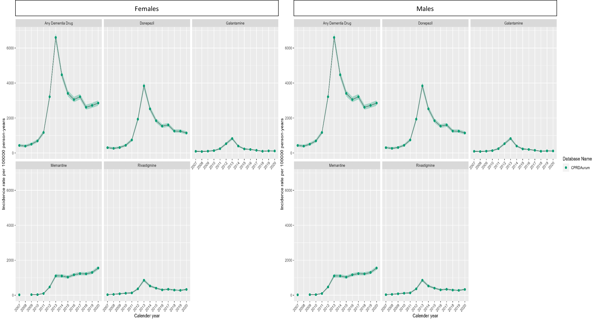
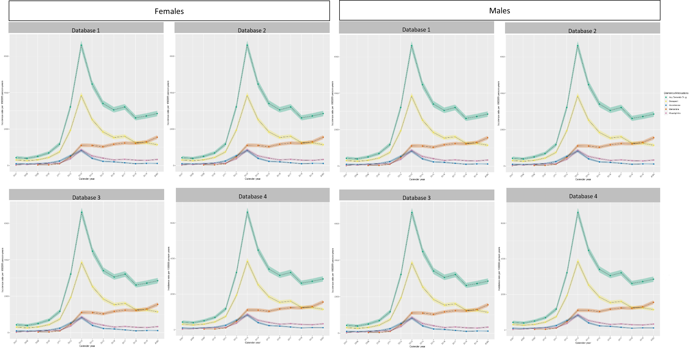
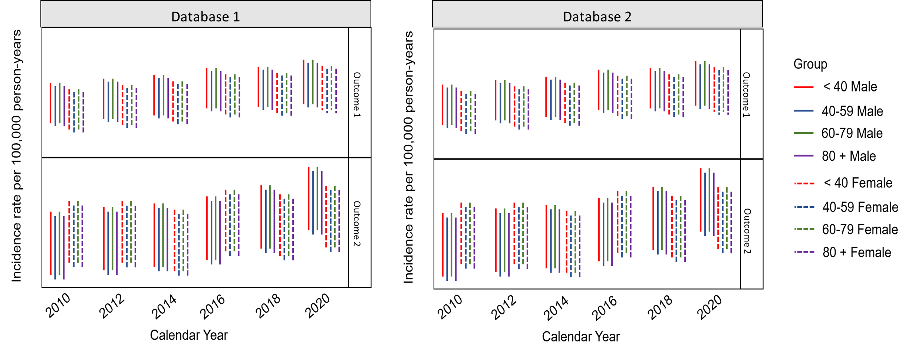
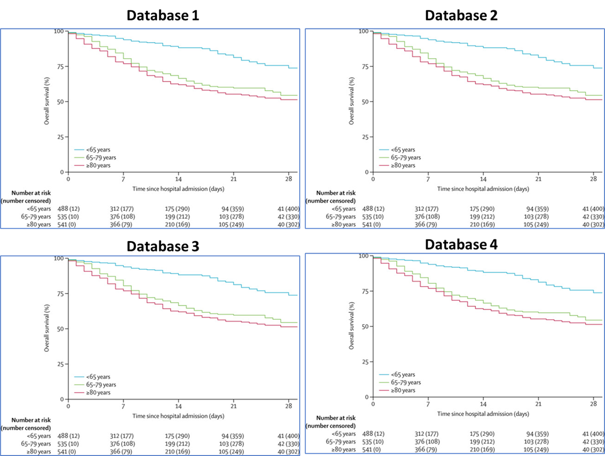

```{r, include = FALSE}
knitr::opts_chunk$set(
  collapse = TRUE,
  comment = "#>"
)
  
prevalence_attrition_general <- readRDS("prevalence_attrition.rds")
incidence_attrition_general <- readRDS("incidence_attrition.rds")

incidence_estimates_general <- readRDS("incidence_estimates.rds")
class(incidence_estimates_general) <- c("IncidencePrevalenceResult", "IncidenceResult", "tbl_df", "tbl", "data.frame")
prevalence_estimates_general <- readRDS("prevalence_estimates.rds")
class(prevalence_estimates_general) <- c("IncidencePrevalenceResult", "IncidenceResult", "tbl_df", "tbl", "data.frame")
```

### INTRODUCTION

ReportGenerator automate study reports for Darwin's Off-the-Shelf studies. Those reports should are based on thhe Complete Catalogue of Standard Data Analyses. In this guide, we show in more detail and how to call every table and figure that ReportGenerator includes when generating a report. 

```{r setup, message= FALSE, warning=FALSE}
library(ReportGenerator)
```

### DRUG UTILISATION STUDIES (DUS)

#### Population-level DUS

### Table 1

##### Complete Catalogue of Standard Data Analyses:

Number of participants and total number of drug/s user/s in each source population during study period. Number of participants per pre-specified strata will be included where necessary/applicable.

##### General considerations:

ReportGenerator provides two options for this object. The first is derived from attrition data and is preferred to be the default option. ReportGenerator calls the function `table1NumPar()` to generate this table and include it in the report. It also generates an automated text description of the graph that the user can edit in the shiny app through the function `table1aAutText()`.

##### DARWIN EU packages that generate the object:

- ReportGenerator

##### Option A – From attrition data

```{r, include = FALSE}
prevalence_attrition <- prevalence_attrition_general
incidence_attrition <- incidence_attrition_general
incidence_estimates <- incidence_estimates_general
```
```{r, echo=FALSE, message=FALSE, warning=FALSE}
table1aAutText(incidence_attrition, prevalence_attrition)

```
```{r, message= FALSE, warning=FALSE}
table1NumPar(prevalence_attrition, incidence_attrition)
```

##### Option B – Number of users by database, sex, age group (IN PROGRESS)

```{r, echo=FALSE}
knitr::include_graphics("Table1OptionB.png")
```

### Figure 1 Incidence over calendar time overall

##### Complete Catalogue of Standard Data Analyses:

Incidence rate/s of drug/s use over calendar time (per year) overall.

##### General considerations:

ReportGenerator identifies how many databases and how many outcomes are available to show in the figures. For each figure, the user interface of the package will show a drop-down menu to select the key visualisations of interest through a set of options. The user can select either a facet by outcome or database. ReportGenerator makes a call to the functions `plotIncidence()` from the IncidencePrevalence package to generate the figures.

```{r, include = FALSE}
incidence_estimates <- incidence_estimates_general %>% filter(denominator_age_group == "18 to 99", denominator_sex == "Both", analysis_interval =="years")
```

##### Option A – facet by outcome, lines per database

```{r, message= FALSE, warning=FALSE }
IncidencePrevalence::plotIncidence(incidence_estimates, 
                                   facet = 'outcome_cohort_name',
                                   colour = 'database_name')
```

##### Option B – facet by database, lines per database

```{r, message= FALSE, warning=FALSE }
IncidencePrevalence::plotIncidence(incidence_estimates,
                                   facet = 'database_name',
                                   colour = 'outcome_cohort_name')
```

### Figure 2a Incidence over calendar time by sex

##### Complete Catalogue of Standard Data Analyses:

Incidence rate/s of drug/s use over calendar time (per year) stratified by sex and age. 

##### General considerations:

ReportGenerator identifies how many databases and how many outcomes are available to show in the figures. For each figure, the user interface of the package will show a drop-down menu to select the key visualisations of interest through a set of options. The user can select either a facet by outcome or database. ReportGenerator makes a call to the functions `plotIncidence()` from the IncidencePrevalence package to generate the figures.

```{r, include = FALSE}
incidence_estimates <- incidence_estimates_general %>% filter(denominator_age_group == "18 to 99", denominator_sex != "Both", analysis_interval == "years", database_name == "CHUBX")
```

##### DARWIN EU packages that generate the object:

- IncidencePrevalence

##### Option A – facet by outcome

```{r, message= FALSE, warning=FALSE }
IncidencePrevalence::plotIncidence(incidence_estimates,
                                   facet = 'outcome_cohort_name', 
                                   colour = 'denominator_sex')
```

##### Option B – facet by database

```{r, message= FALSE, warning=FALSE }
IncidencePrevalence::plotIncidence(incidence_estimates,
                                   facet = 'database_name',
                                   colour = 'denominator_sex')
```

##### Option C – Facet by sex, outcome and database (IN PROGRESS)

```{r, echo=FALSE}


```

##### Option D – Facet by sex, database and database (IN PROGRESS)

```{r, echo=FALSE}


```

### Figure 2b Incidence over calendar time by age

##### Complete Catalogue of Standard Data Analyses:

Incidence rate/s of drug/s use over calendar time (per year) stratified by age. 

##### General considerations:

ReportGenerator identifies how many databases and how many outcomes are available to show in the figures. For each figure, the user interface of the package will show a drop-down menu to select the key visualisations of interest through a set of options. The user can select either a facet by outcome or database. ReportGenerator makes a call to the functions `plotIncidence()` from the IncidencePrevalence package to generate the figures.

##### DARWIN EU packages that generate the object:

- IncidencePrevalence

```{r, include = FALSE}
incidence_estimates <- incidence_estimates_general %>% filter(denominator_sex == "Both", analysis_interval == "years", denominator_age_group != "18 to 99", database_name == "CHUBX")
```

##### Option A – facet by outcome, lines per database

```{r, message= FALSE, warning=FALSE }
IncidencePrevalence::plotIncidence(incidence_estimates,
                                   facet = 'outcome_cohort_name', 
                                   colour = 'denominator_age_group')
```

##### Option B – facet by database, lines per database

```{r, message= FALSE, warning=FALSE }
IncidencePrevalence::plotIncidence(incidence_estimates,
                                   facet = 'database_name',
                                   colour = 'denominator_age_group')
```

##### Option C – facet by outcome and database, lines per age group (IN PROGRESS)

- Lines should be points with 95% CI. 

```{r, echo=FALSE}
knitr::include_graphics("Figure2cAgeGroup.png")

```

##### Option D – facet by database and outcome, lines per database (IN PROGRESS)

```{r, echo=FALSE}


```


### Figure 3 Prevalence over calendar time overall

##### Complete Catalogue of Standard Data Analyses:

Prevalence rate/s of drug/s use over calendar time (per year) overall.

##### General considerations:

ReportGenerator identifies how many databases and how many outcomes are available to show in the figures. For each figure, the user interface of the package will show a drop-down menu to select the key visualisations of interest through a set of options. The user can select either a facet by outcome or database. ReportGenerator makes a call to the functions `plotPrevalence()` from the IncidencePrevalence package to generate the figures.

##### DARWIN EU packages that generate the object:

- IncidencePrevalence

```{r, include = FALSE}
prevalence_estimates <- prevalence_estimates_general %>% filter(denominator_age_group == "18 to 99", denominator_sex == "Both", analysis_interval =="years", analysis_type == "point")
```

##### Option A – facet by outcome, lines per database

```{r, message= FALSE, warning=FALSE }
IncidencePrevalence::plotPrevalence(prevalence_estimates, 
                                   facet = 'outcome_cohort_name',
                                   colour = 'database_name')
```

##### Option B – facet by database, lines per database

```{r, message= FALSE, warning=FALSE }
IncidencePrevalence::plotPrevalence(prevalence_estimates,
                                   facet = 'database_name',
                                   colour = 'outcome_cohort_name')
```

### Figure 4 Prevalence over calendar time by sex

##### Complete Catalogue of Standard Data Analyses:

Prevalence rate/s of drug/s use over calendar time (per year) stratified by sex and age. 

##### General considerations:

ReportGenerator identifies how many databases and how many outcomes are available to show in the figures. For each figure, the user interface of the package will show a drop-down menu to select the key visualisations of interest through a set of options. The user can select either a facet by outcome or database. ReportGenerator makes a call to the functions `plotPrevalence()` from the IncidencePrevalence package to generate the figures.

##### DARWIN EU packages that generate the object:

- IncidencePrevalence

```{r, include = FALSE}
prevalence_estimates <- prevalence_estimates_general %>% filter(denominator_age_group == "18 to 99", denominator_sex != "Both", analysis_interval == "years", database_name == "CHUBX", analysis_type == "point")
```

##### Option A – facet by outcome, lines per database

```{r, message= FALSE, warning=FALSE }
IncidencePrevalence::plotPrevalence(prevalence_estimates,
                                   facet = 'outcome_cohort_name', 
                                   colour = 'denominator_sex')
```

##### Option B – facet by database, lines per database

```{r, message= FALSE, warning=FALSE }
IncidencePrevalence::plotPrevalence(prevalence_estimates,
                                   facet = 'database_name',
                                   colour = 'denominator_sex')
```

##### Option C – facet by sex, outcome and database lines per database (IN PROGRESS)

```{r, echo=FALSE}


```

##### Option D – facet by sex, database and outcome, lines per database (IN PROGRESS)

```{r, echo=FALSE}


```


### Figure 2a Prevalence over calendar time by age

##### Complete Catalogue of Standard Data Analyses:

Prevalence rate/s of drug/s use over calendar time (per year) stratified by age. 

##### General considerations:

ReportGenerator identifies how many databases and how many outcomes are available to show in the figures. For each figure, the user interface of the package will show a drop-down menu to select the key visualisations of interest through a set of options. The user can select either a facet by outcome or database. ReportGenerator makes a call to the functions `plotPrevalence()` from the IncidencePrevalence package to generate the figures.

##### DARWIN EU packages that generate the object:

- IncidencePrevalence

```{r, include = FALSE}
prevalence_estimates <- prevalence_estimates_general %>% filter(denominator_sex == "Both", analysis_interval == "years", denominator_age_group != "18 to 99", database_name == "CHUBX", analysis_type == "point")
```

##### Option A – facet by outcome, lines per database

```{r, message= FALSE, warning=FALSE }
IncidencePrevalence::plotPrevalence(prevalence_estimates,
                                   facet = 'outcome_cohort_name', 
                                   colour = 'denominator_age_group')
```

##### Option B – facet by database, lines per database

```{r, message= FALSE, warning=FALSE }
IncidencePrevalence::plotPrevalence(prevalence_estimates,
                                   facet = 'database_name',
                                   colour = 'denominator_age_group')
```

### Kaplan-Meier (IN PROGRESS)

##### Complete Catalogue of Standard Data Analyses:

Kaplan-Meier or Cumulative Incidence Function plots of the probability of a pre-specified outcome following index diagnosis of the condition of interest.

##### General considerations:

-	Facet by database – outcome, colour for strata.
-	Include confidence intervals.

```{r, echo=FALSE}



```

